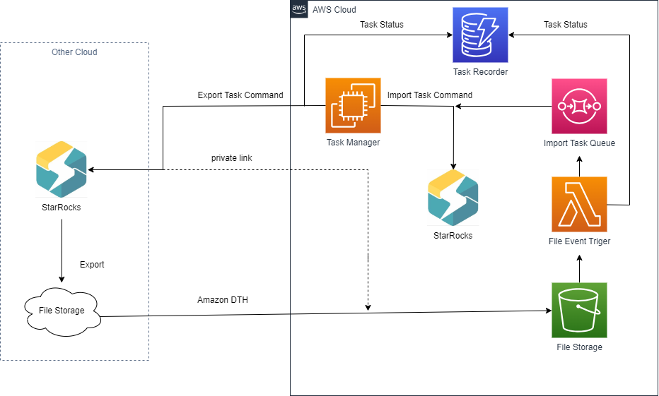
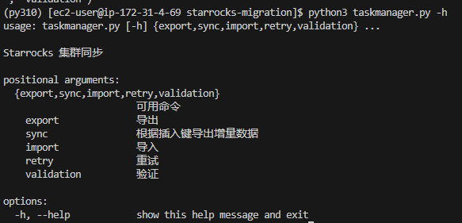

# StarRocks-Migration-Tool

## 工具说明
StarRocks-Migration-Tool主要的使用场景是从其他云将 StarRocks 存算分离集群的数据迁移到Amazon Cloud的 StarRocks 集群

*源集群如果是 StarRocks 非存算分离版本，请直接使用官方提供的迁移工具*

## 针对版本
StarRocks 3.1.x 存算分离版本版本
3.2.4以后的存算分离版本版本，请参考其他branch

## 架构


### 核心组件
1. Task Manager负责任务的调度和管理。一般可以部署在ec2或者eks中。负责处理的任务主要有两种，一种是导出任务，从源StarRocks 导出数据。一种数导入任务，从对象存储中，把数据导入目标集群。Task Manager还负责任务的编排，队列管理，状态记录等
2. File Event Trgger。一般由Amazon Lambda实现， 负责在目标端的对象存储接收到新文件后，负责将文件的状态信息写入Task Recorder中，并推送到Task Queue中
3. Task Queue。 一般由Amazon SQS实现。记录任务的元信息，包括任务文件位置，数据所属于的分区等。Task Manager 会从Task Queue中消费任务，并转化成导入命令
4. DTH。 如果源集群和目标集群之间没有专线，之间通过公网跨云传输任务，在数据量较大的情况下，由于网络抖动，容易出现传输失败，或者部分传输。这种情况下建议使用DTH。源集群先把数据导入源端对象存储，再使用DTH 利用对象存储的公网带宽，同步到目标端对象存储
5. File Storage。一般由对象存储实现，AWS 中使用S3

### 架构说明
1. Task Manager 读取源集群后，按分区将数据导出到源端对象存储，并把每个正在导出的任务状态设置为 exporting
2. DTH 监听到源对象存储有新文件产生后，将文件传输到目标端对象存储(S3)
3. File Event Trgger 监听到有新的文件产生后，推送到Task Queue 中，并记录任务状态
4. Task Manager 从 Task Queue中消费任务，并产生导入任务指令，发送给目标端StarRocks
5. Task Manager 监听 StarRocks 导入任务状态，并记录到Task Recorder

## 操作手册
### 前提条件
1. 创建名为 starrocks-migration-task-trace-event 的Dyanmodb 做为迁移任务状态的记录表
2. 创建一个普通的SQS队列，用于任务队列
3. 至少创建好一个中间的 S3 桶，并且配置好VPC S3 gateway endpoint,保证能通过内网访问S3 
3. 编辑 file_event.py 中的配置部分
4. 根据 配置文件说明，编辑.env文件，配置好源集群，目标集群，备份对象存储信息


### 手动部署
*Task Manager 建议部署在AWS EC2中，也可以部署在其他云的云主机中*
*必须设置好前提条件中的所需内容*
1. git clone 本项目代码在AWS EC2中
2. 配置EC2的绑定的角色，角色权限需要具有读写DynamoDB和SQS的权限
3. 创建 Lambda函数，代码文件为 file_event.py


### 存量迁移
1. 如果使用 DTH， 请根据.env配置文件中的说明，分别在源端和目标端创建一个对象存储桶。 同步源端和目标端对象存储
2. 如果使用专线，只需要在目标端配置一个S3桶，但是需要配置好VPC S3 gateway endpoint
3. 在目标端的aws 环境 创建lambda函数,lambda函数的代码参考文件 file_event.py
5. 配置该lambda函数做为目标端对象存储s3 的event triger
6. 在一个控制台启动 Task Manager的导入监听程序
```
python3 taskmanager.py import --env .env --job test1 
```
7. 新启动一个控制台，启动Task Manager 的导出程序
```
python3 taskmanager.py export --env .env --job test1 
```
8. 查看其他命令可以
```
python3 taskmanager.py -h
```



例如：
```
## 重新导入partition  p20241108 的所有数据
python3 taskmanager.py retry --job u23 --content p20250223

## 重新导入指定任务的所有失败数据
python3 taskmanager.py retry --job forfill
```

### 增量迁移
1. 对需要迁移的表，都创建一张增量表，并且在业务的进行双写，即在启动Task Manager 之前，将后续数据双写入增量表中
2. 按存量迁移过程进行存量数据迁移
3. 存量数据迁移后，对创建的增量表进行迁移

## 配置文件说明
配置文件为.env文件
```
# 并发导出的初始并发度,【后续会根据源集群的内存，cpu, io latency 等指标，进行动态控制】
CONCURRENCY=5

# 导出数据的目标位置,用逗号隔开多个，第一个默认做为源集群数据导出的，最后一个默认是目标集群导入的数据文件的存储位置。如果是多个对象存储之间，则需要使用DTH 进行同步
STORAGES=oss://tx-mock-data/sunex,s3://tx-mock-data/sunex

# REGION
AWS_REGION=us-east-2
# 如果所在的执行环境没有绑定拥有权限的的角色，则需要配置AK, SK
AK=
SK=

# 数据来源的STARROCKS 集群，user 需要具有对源集群目标数据库表的数据读取权限，Schema读取权限
# FE 地址
SOURCE_HOST=172.31.23.29
SOURCE_PORT=9030
SOURCE_USER=root
SOURCE_PWD=demo1234
SOURCE_DB_NAME=sungorwpro

# 目标STARROCKS 集群
# FE 地址
TARGET_HOST=172.31.23.29
TARGET_PORT=9030
TARGET_USER=root
TARGET_PWD=demo1234
TARGET_DB_NAME=sungorwpro

# 要导出的表集合,多个表用逗号隔开
TABLE_NAMES=data_point_val,data_point_user
TASK_FILTER=pt2021111
```
## 其他部署方式

### CloudFormation
开发中...

## 其他功能
### 导出备份
python3 app.py export --env .env_ex_au
### 手动导入
python3 app.py export --env .env_im_au


## 注意
1. 使用导出导入方式进行数据迁移的原因
StarRocks 3.1.x存算分离版本导出仅支持export导出，并且只支持csv格式
2. starrocks-migration-task-trace-event 表的设计
```
task_name:任务名称
格式：s3://{bucket_name}/自定义存储前缀/{job_name}/{db_name}/{table_name}/{partition_name}/{file_name}
数据类型：字符串

status：任务状态
数据类型：字符串


update_time：任务更新时间
数据类型：字符串
```
3. 需要配置dynamodb vpc gateway endpoint
4. 需要配置s3 vpc gateway endpoint(便宜)
5. 请检查导出文件路径信息是否如下可是（可以查看s3或者 dynamodb中的信息)
```
s3://bucket_name/前缀路径(配置文件中配置)/job_name/db_name/table_name/partition_name/file_name.csv
```

