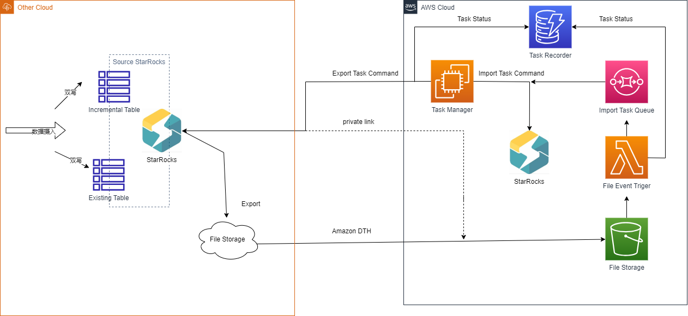

# StarRocks-Migration-Tool
## 针对版本
StarRocks 1.2+版本
其他版本，请参考其他branch
## 工具说明
StarRocks-Migration-Tool主要的使用场景是从其他云将 StarRocks 存算分离集群的数据迁移到Amazon Cloud的 StarRocks 集群

*源集群如果是 StarRocks 非存算分离版本，请直接使用官方提供的迁移工具*

## 架构


### 核心组件
1. Task Manager负责任务的调度和管理。一般可以部署在ec2或者eks中。负责处理的任务主要有两种，一种是导出任务，从源StarRocks 导出数据。一种数导入任务，从对象存储中，把数据导入目标集群。Task Manager还负责任务的编排，队列管理，状态记录等
2. File Event Trgger。一般由Amazon Lambda实现， 负责在目标端的对象存储接收到新文件后，负责将文件的状态信息写入Task Recorder中，并推送到Task Queue中
3. Task Queue。 一般由Amazon SQS实现。记录任务的元信息，包括任务文件位置，数据所属于的分区等。Task Manager 会从Task Queue中消费任务，并转化成导入命令
4. DTH。 如果源集群和目标集群之间没有专线，之间通过公网跨云传输任务，在数据量较大的情况下，由于网络抖动，容易出现传输失败，或者部分传输。这种情况下建议使用DTH。源集群先把数据导入源端对象存储，再使用DTH 利用对象存储的公网带宽，同步到目标端对象存储
5. File Storage。一般由对象存储实现，AWS 中使用S3

### 架构说明
1. Task Manager 读取源集群后，按分区将数据导出到源端对象存储，并把每个正在导出的任务状态设置为 exporting
2. DTH 监听到源对象存储有新文件产生后，将文件传输到目标端对象存储(S3)
3. File Event Trgger 监听到有新的文件产生后，推送到Task Queue 中，并记录任务状态
4. Task Manager 从 Task Queue中消费任务，并产生导入任务指令，发送给目标端StarRocks
5. Task Manager 监听 StarRocks 导入任务状态，并记录到Task Recorder

## 操作手册
### 配置环境变量文件
配置文件为.env文件
```
# 并发导出的初始并发度,【后续会根据源集群的内存，cpu, io latency 等指标，进行动态控制】
CONCURRENCY=5

# 导出数据的目标位置,用逗号隔开多个，第一个默认做为源集群数据导出的，最后一个默认是目标集群导入的数据文件的存储位置。如果是多个对象存储之间，则需要使用DTH 进行同步
STORAGES=oss://tx-mock-data/sunex,s3://tx-mock-data/sunex

# REGION
AWS_REGION=us-east-2
# 如果所在的执行环境没有绑定拥有权限的的角色，则需要配置AK, SK
AK=
SK=

# 数据来源的STARROCKS 集群，user 需要具有对源集群目标数据库表的数据读取权限，Schema读取权限
# FE 地址
SOURCE_HOST=172.31.23.29
SOURCE_PORT=9030
SOURCE_USER=root
SOURCE_PWD=demo1234
SOURCE_DB_NAME=sungorwpro

# 目标STARROCKS 集群
# FE 地址
TARGET_HOST=172.31.23.29
TARGET_PORT=9030
TARGET_USER=root
TARGET_PWD=demo1234
TARGET_DB_NAME=sungorwpro

# 要导出的表集合,多个表用逗号隔开
TABLE_NAMES=data_point_val,data_point_user,
```
### 部署环境
#### 部署 Task Manager
1. Task Manager 建议部署在AWS EC2中，也可以部署在其他云的云主机中
2. 
#### 部署 File Event Trigger
1. 创建 Lambda函数，代码文件为 file_event_listener.py

## 其他功能
### 导出备份
python3 app.py export --env .env_ex_au
### 手动导入
python3 app.py export --env .env_im_au

### 同步 从集群A 到集群B
开发中...
python3 app.py sync --env .env


## Tip
###  for starrocks 3.1
导出只支持export ，并且只支持csv格式
